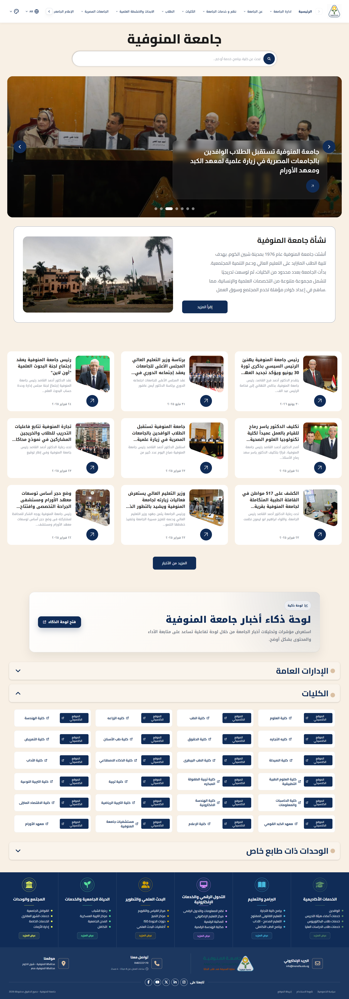
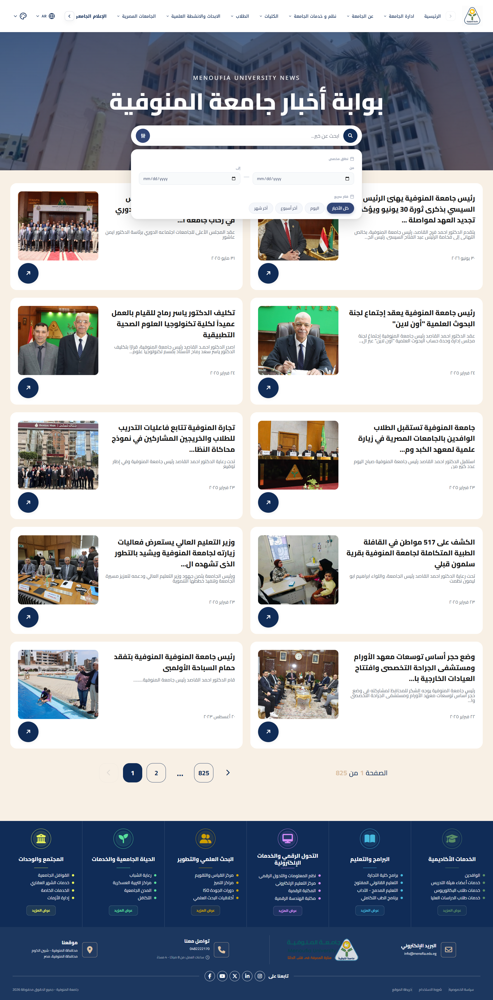
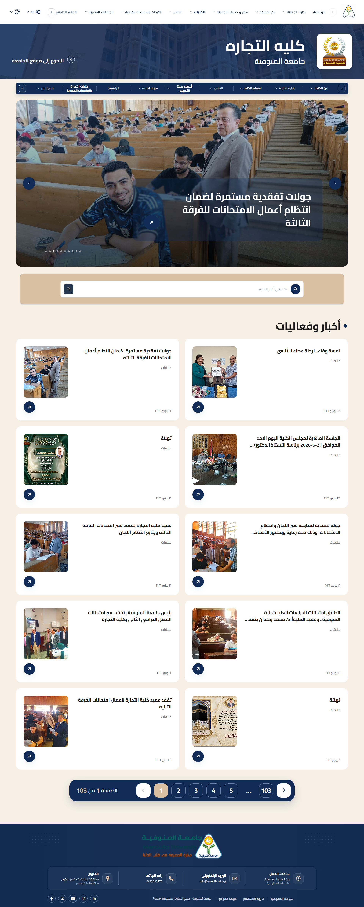
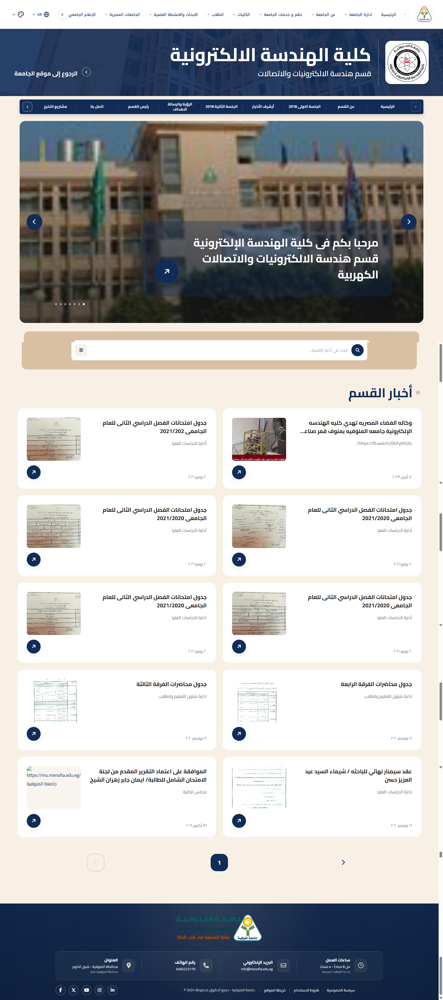
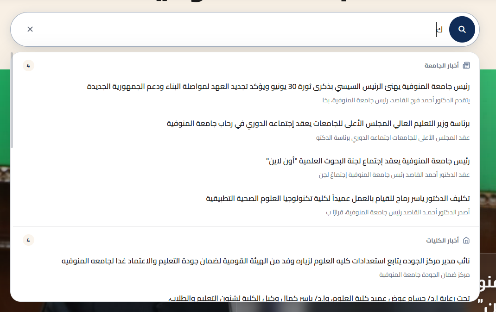
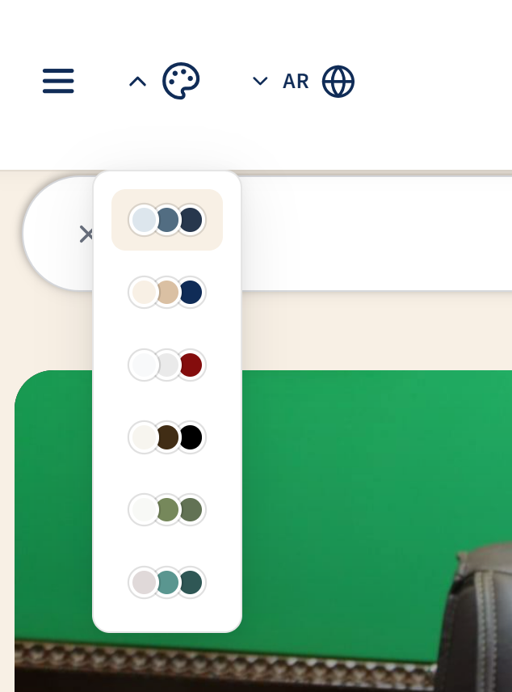

# Menoufia University Portal — Multilingual University Frontend Platform

Menoufia University Portal is a dynamic multilingual university frontend platform built with **React**, **Vite**, **TypeScript/JavaScript**, **i18next**, and **REST API integration**.

The project was rebuilt and expanded from a limited expatriates-focused portal into a complete university platform covering university news, faculties, departments, sectors, special units, general administrations, global search, theme palettes, RTL/LTR layouts, and responsive user interfaces.

## Live Demo

[View Website](https://menoufia-university.vercel.app/)

> The frontend is deployed on Vercel. Some API-driven content may be restricted in production depending on the external Menoufia University staging API availability, CORS configuration, and access rules.

## Screenshots

### Home Page

<p align="center">
  
</p>

---

### Core Pages

| News Page | Faculty Page |
|---|---|
|  |  |

| Department Page | Global Search |
|---|---|
|  |  |

### Theme System

<p align="center">
  
</p>

---

## Overview

This project represents a full frontend rebuild and expansion of a university portal.

The original version was focused mainly on expatriates-related content and basic pages. The new version was transformed into a broader Menoufia University portal with dynamic API-driven content, advanced routing, multilingual support, faculty and department pages, university sectors, special units, general administrations, search, theme customization, and responsive layouts.

---

## Key Features

- Multilingual university portal
- Arabic RTL and LTR language support
- Dynamic university news
- News listing and news details pages
- Faculty pages
- Faculty news pages
- Faculty news details
- Faculty highlights
- Department pages
- Department highlight/details pages
- University sectors pages
- Special units pages
- General administrations section
- Colleges and programs pages
- Global search
- Theme palette system
- Dynamic routing
- API service layer
- Swagger-documented external API integration
- Splash screen
- Intro video
- Custom 404 error page
- Responsive UI
- Reusable layout components
- Faculty-specific footer
- Image URL normalization and fallback handling

---

## Frontend Transformation

The project evolved from a simple expatriates portal into a full university frontend platform.

### Before

The previous structure included basic pages such as:

- Home
- News
- News details
- Contact
- Colleges
- Programs
- Login

### After

The rebuilt version includes a much larger structure with:

- Dynamic university homepage
- API-driven news modules
- Faculty pages
- Faculty news and highlights
- Department pages
- University sectors
- Special units
- General administrations
- Global search
- Theme palettes
- Multilingual folders
- Splash screen
- Intro video
- Error handling
- Shared faculty footer
- Utility helpers
- Centralized API service layer

---

## Tech Stack

- React.js
- Vite
- TypeScript
- JavaScript
- CSS
- i18next
- React Router
- Axios
- REST APIs
- RTL/LTR layouts
- Theme context
- Responsive design

---

## Project Structure

```txt
Menoufia-University-Portal
├─ public
├─ src
│  ├─ App.jsx
│  ├─ main.jsx
│  ├─ i18n.ts
│  ├─ Services
│  │  ├─ api.js
│  │  └─ newsService.js
│  ├─ HomePage
│  │  ├─ Header
│  │  ├─ Hero
│  │  ├─ Carousel
│  │  ├─ About
│  │  ├─ GlobalSearch
│  │  ├─ CollegesPrograms
│  │  ├─ GeneralAdministrationsSection
│  │  ├─ SpecialUnitsSection
│  │  ├─ UniversityHistory
│  │  └─ Footer
│  ├─ NewsPage
│  ├─ NewsDetails
│  ├─ FacultyNewsPage
│  ├─ FacultyNewsDetails
│  ├─ FacultyHighlightDetails
│  ├─ DepartmentPage
│  ├─ UniversityArticlePage
│  ├─ UniversitySectorsPage
│  ├─ SpecialUnitPage
│  ├─ GeneralAdministrationsPage
│  ├─ CollegeAndProgramsPage
│  ├─ Collages
│  ├─ ProgramsPage
│  ├─ ContactUsPage
│  ├─ LoginPage
│  ├─ ErrorPage
│  ├─ SplashScreen
│  ├─ IntroVideo
│  ├─ Shared
│  │  └─ FacultyFooter
│  ├─ theme
│  │  ├─ palettes.js
│  │  └─ ThemeContext.jsx
│  ├─ Local
│  └─ utils
│     ├─ imageHelper.jsx
│     └─ language.ts
├─ vite.config.js
└─ package.json
```

---

## Main Modules

### University Homepage

The homepage includes hero content, latest university news, search, university history, colleges, general administrations, special units, and footer sections.

### News Module

The news module supports university news listing, filtering, API-driven content, and news details pages.

### Faculty Module

Faculty pages include faculty-specific news, highlights, internal navigation, dynamic details pages, and faculty footer sections.

### Department Module

Department pages provide dynamic department-level content, highlights, and details pages.

### Search Module

The global search provides a unified search experience across university-related content.

### Theme System

The portal includes multiple theme palettes controlled globally across the UI using CSS variables and React context.

### Multilingual Support

The project uses i18next and multiple translation folders to support multilingual UI structure with RTL/LTR handling.

---

## API Integration

The project uses a centralized service layer for API communication.

Main service files:

```txt
src/Services/api.js
src/Services/newsService.js
```

The frontend integrates with external Menoufia University REST APIs to fetch dynamic university content, including university news, faculty content, department content, sectors, special units, menus, and article details.

### External API Source

University staging website:

[Menoufia University Staging](https://stage.menofia.edu.eg/)

Swagger API documentation:

[Menoufia University Swagger API](https://stage.menofia.edu.eg:5050/swagger/index.html)

API base URL:

```txt
https://stage.menofia.edu.eg:5050/api
```

> Some API-driven content may depend on the availability, CORS configuration, and access rules of the external university staging server.

## My Role

I led most of the frontend implementation, including the portal restructure, dynamic routing, API integration, multilingual support, theme system, responsive pages, university modules, faculty pages, department pages, global search, and reusable UI components.

---

## Status

Frontend platform completed.  
Live deployment is available, while some API-driven content may depend on external university API availability in the deployed environment.

---

## Author

Built by **Kareem Mohamed Hanafy**.

GitHub: [Karrim0](https://github.com/Karrim0)
